# Context-Aware Agentic Chat Gateway (`ai-agent-gateway`)

An edge-optimized AI middleware routing pipeline built for V8 isolate nodes. The gateway embeds real-time user prompts, performs a **Dynamic RAG** lookup against a **Pinecone** vector index (via **LangChain** embeddings), streams completions from **OpenAI**, and transparently degrades to a **local Llama 3** model when the primary provider is unavailable. Raw provider streams are transformed into standard Text Event Streams for immediate client-side rendering.

## Architecture Topology

```mermaid
graph TD
    A[Browser Client Ingress] -->|JSON Prompt Payload| B[Next.js 15 Edge Worker]
    B -->|Step 1: Embed + Vector Query| C[(Pinecone Vector DB)]
    C -->|Top-k Context| B
    B -->|Step 2: Stream Allocation| D[OpenAI API]
    D -->|Async Token Delivery| B
    D -.->|On failure| F[Local Llama 3 Fallback]
    F -.->|Async Token Delivery| B
    B -->|Step 3: Text Event Stream Transform| E[Immediate Browser Rendering]

    style B fill:#1e1e2f,stroke:#8b5cf6,stroke-width:2px
    style C fill:#0f172a,stroke:#22c55e,stroke-width:2px
    style D fill:#0f172a,stroke:#ec4899,stroke-width:2px
    style F fill:#0f172a,stroke:#f59e0b,stroke-width:2px
```



## AI Integration Specs

| Capability      | Implementation                                             |
| --------------- | ---------------------------------------------------------- |
| Execution Type  | Edge Workers (`runtime = 'edge'`)                          |
| Context Length  | Dynamic RAG — top-k Pinecone retrieval per request         |
| Fallback Loop   | Local Llama 3 via an OpenAI-compatible endpoint (Ollama)   |
| Streaming       | Web Streams API → `text/event-stream`                      |

## System Stack & Core Dependencies

- **Runtime:** Next.js 15 App Router (Edge)
- **Inference:** OpenAI Node SDK v5
- **Vector DB:** Pinecone (`@pinecone-database/pinecone`)
- **Embeddings / Orchestration:** LangChain (`@langchain/openai`, `@langchain/core`)
- **Fallback Model:** Llama 3 (local, OpenAI-compatible API)
- **Streaming Interface:** Web Streams API

## File Directory Structure

```text
ai-agent-gateway/
├── src/
│   ├── app/
│   │   └── api/
│   │       └── chat/
│   │           └── route.ts     # Edge worker entry point: RAG + streaming + fallback
│   └── lib/
│       ├── pinecone.ts          # LangChain embeddings + Pinecone vector retrieval
│       └── llama.ts             # Local Llama 3 fallback client
├── .env.example
├── next.config.mjs
├── tsconfig.json
├── package.json
└── README.md
```

## Setup & Local Verification

### 1. Install dependencies

```bash
npm install
```

### 2. Configure environment

Copy `.env.example` to `.env.local` and fill in your credentials:

```bash
cp .env.example .env.local
```

```dotenv
# Primary cloud inference provider
OPENAI_API_KEY=your_openai_api_key_here
OPENAI_MODEL=gpt-4o-mini
OPENAI_EMBEDDING_MODEL=text-embedding-3-small

# Pinecone vector database (Dynamic RAG)
PINECONE_API_KEY=your_pinecone_api_key_here
PINECONE_INDEX=agentic-chat-gateway

# Local Llama 3 fallback (OpenAI-compatible endpoint, e.g. Ollama)
LLAMA_BASE_URL=http://localhost:11434/v1
LLAMA_MODEL=llama3
LLAMA_API_KEY=ollama
```

> The Llama 3 fallback expects an OpenAI-compatible server. With [Ollama](https://ollama.com): `ollama pull llama3 && ollama serve`.

### 3. Run and test the stream

```bash
npm run dev
```

```bash
curl -N -X POST http://localhost:3000/api/chat \
  -H "Content-Type: application/json" \
  -d '{"userPrompt":"Summarize the deployment steps","conversationHistory":[]}'
```

The server returns partial text chunks under `text/event-stream`. The response
`X-Inference-Source` header reports which engine answered (`openai` or
`llama3-fallback`).

## Request Contract

`POST /api/chat`

```jsonc
{
  "userPrompt": "string (required)",
  "conversationHistory": [
    { "role": "user | assistant | system", "content": "string" }
  ]
}
```

## Pipeline Flow

1. **Retrieve** — the prompt is embedded (LangChain `OpenAIEmbeddings`) and matched against the Pinecone index; the top-k passages are assembled into the system context. Retrieval is best-effort: a vector-DB failure degrades to a no-context answer rather than failing the request.
2. **Generate** — messages are streamed from the primary OpenAI model.
3. **Fallback** — if the primary call fails (rate limit, timeout, outage), the same messages are retried against the local Llama 3 model. If both fail, the gateway responds `502`.
